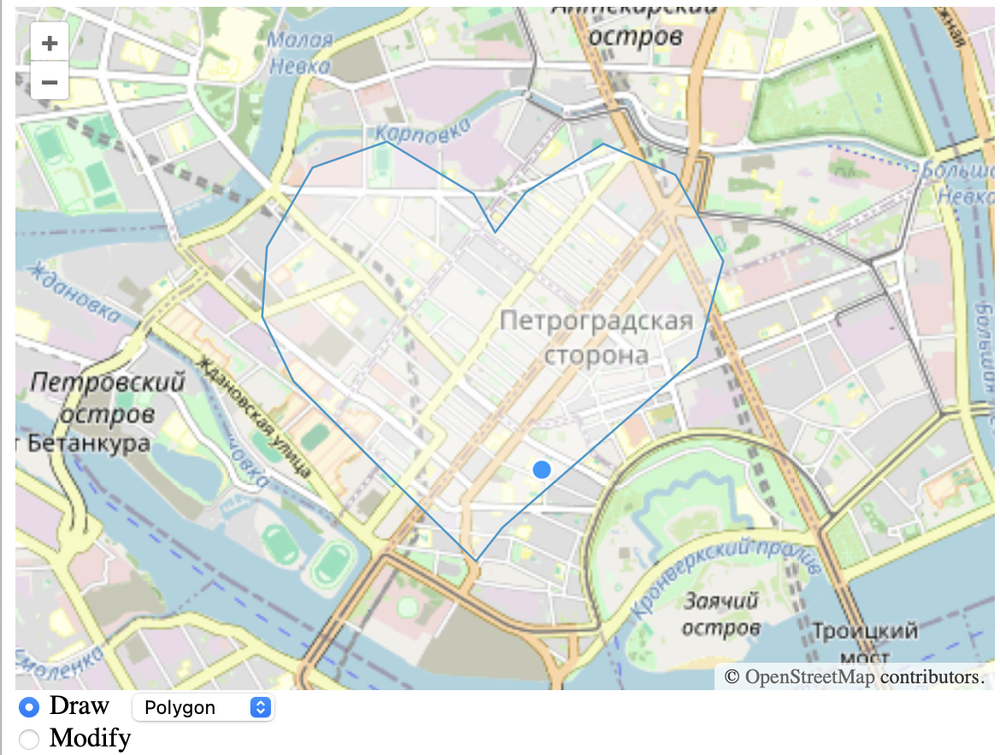

# Практика 1



## ТЗ

Сделаем на Golang геоинформационную базу данных. 
Архитектуру сделаем сразу "по-взрослому", а реализацию простой и наивной.

Для сериализации данных используем `geojson` формат https://geojson.org.

Для идентификации `geojson` используем поле `ID`. Поле `ID` заполняется значением `uuid` на фронтенде.

Информацию об объектах просто сохраняем в `geo.db.json` файл.

Для работы с фронтендом реализовываем `http api`.

## Архитектура


## Более точная архитектура


## Стек технологий

- backend: golang
- frontend: готовый проект на openlayers

## Подготовка

- В директории курса

```
mkdir practice1
cd practice1
go mod init practice1
cd ..
go work use practice1
```

## Backend

Реализуем три части.
- Первая часть – наносервис Router.
- Вторая часть – наносервис Storage.
- Третья часть – запуск и остановка http.Server

Для обработки GeoJSON данных возьмем библиотеку `github.com/paulmach/orb/geojson`

## Сначала тестирование (тот самый TDD)

## HTTP API

- API возвращает:
  - 200, если всё ок
  - 407 для редиректа
  - Иначе код ошибки и сообщение в body
- `GET /select`
  - После редиректов должно придти 200
- `POST /insert` + объект в body
  - После редиректов должно придти 200
- `POST /replace` + объект в body
  - После редиректов должно придти 200
- `POST /delete` + объект в body с ID
  - После редиректов должно придти 200

### Тест для HTTP API

Сделаем тест на вставку, замену и удаление данных.
Чтобы написать тест, надо назвать файл так, чтобы он заканчивался на `_test.go`
Для тестирования http запросов можно пользоваться объектами:
- `http.NewRequest(...)` – для запроса
- `httptest.NewRecorder(...)` – для записи ответа

Например, сделаем `main_test.go`.
```golang

func TestSimple(t *testing.T) {
	mux := http.NewServeMux()

	s := NewStorage(mux, "test", []string{}, true)
	go func() { s.Run() }()

	r := NewRouter(mux, [][]string{{"test"}})
	go func() { r.Run() }()
	t.Cleanup(r.Stop)

	t.Cleanup(s.Stop)

	feature := geojson.NewFeature(orb.Point{rand.Float64(), rand.Float64()})
	body, err := feature.MarshalJSON()
	if err != nil {
		t.Fatal(err)
	}
	req, err := http.NewRequest("POST", "/insert", bytes.NewReader(body))
	if err != nil {
		t.Fatal(err)
	}
	rr := httptest.NewRecorder()
	mux.ServeHTTP(rr, req)
	if rr.Code == http.StatusTemporaryRedirect {
		req, err := http.NewRequest("POST", rr.Header().Get("location"), bytes.NewReader(body))
		if err != nil {
			t.Fatal(err)
		}
		rr := httptest.NewRecorder()

		mux.ServeHTTP(rr, req)

		if rr.Code != http.StatusOK {
			t.Errorf("handler returned wrong status code: got %v want %v", rr.Code, http.StatusOK)
		}
	} else if rr.Code != http.StatusOK {
		t.Errorf("handler returned wrong status code: got %v want %v", rr.Code, http.StatusOK)
	}
}
```

Для удобного создания большого количества тестов можно воспользоваться табличными шаблоном тестирования.
https://go.dev/wiki/TableDrivenTests

## Наносервис

Скелет наносервиса:

```
struct Router {
  // поля
}

func NewRouter(аргументы) *Router { конструктор нано сервиса }

func (r *Router) Run() { }
func (r *Router) Stop() { }
```

- Сделаем наносервис `Router`, который регистрирует свой HTTP API в `http.ServerMux`
- Сделаем наносервис `Storage`, который регистрирует свой HTTP API в `http.ServerMux`

Конструктор структуры Router:
- `NewRouter(mux *http.ServeMux, nodes [][]string) *Router`
  - `mux` – роутер http запросов
  - `nodes` – список `Storage` узлов (пока что будет только один узел)

Конструктор структуры Storage:
- `NewStorage(mux *http.ServeMux, name string, replicas []string, leader bool) *Storage`
  - `mux` – роутер http запросов
  - `name` – имя данного `Storage` узла
  - `replicas` – на будущее
  - `leader` – на будущее

Расположим в структурах методы обработчики `http api`.
Организовать наносервисы следующим образом.
- Сделаем глобальный объект `mux *http.ServerMux`
- Передадим объект и в конструктор `Router`, и в конструктор `Storage`
- Зададим произвольное имя для `Storage`
- Запустим и `Storage`, и `Router` в отдельных горутинах
- Передадим это имя в конструктор `Router`
- Запустим `http server` на `127.0.0.1:8080`
  - Передадим туда глобальный `mux`
- Запустим `http server` в отдельной горутине
- Запустим ожидание сигнала
  ```
  sigChan := make(chan os.Signal, 1)
  signal.Notify(sigChan, syscall.SIGINT, syscall.SIGTERM)
  sig := <-sigChan
  slog.Info("got", "signal", sig)
  ```
- После получения сигнала остановим сервисы в обратном порядке
  - `http.Server`
  - `Router`
  - `Storage`

## HTTP API

API возвращает:
  - 200, если всё ок
  - 407 для редиректа
  - Иначе код ошибки и сообщение в body

### Router

HTTP endpoints:
- `GET /*`
  - Вернуть ресурсы фронтенда из директории `../front/dist/*`
- `GET /select`
  - Редиректить на Storage с кодом http.StatusTemporaryRedirect
- `POST /insert`
  - Редиректить на Storage с кодом http.StatusTemporaryRedirect
- `POST /replace`
  - Редиректить на Storage с кодом http.StatusTemporaryRedirect
- `POST /delete`
  - Редиректить на Storage с кодом http.StatusTemporaryRedirect

### Storage

HTTP endpoints:
- `GET {name}/select`
  - Вернуть `geojson` объекты в формате `feature collection`
- `POST {name}/insert`
  - Сохранить новый `geojson` объект из `body` запроса
- `POST {name}/replace`
  - Заменить сохранённый ранее `geojson` объект из `body` запроса
- `POST {name}/delete`
  - Удалить сохранённый ранее `geojson` объект `id` из `body` запроса
